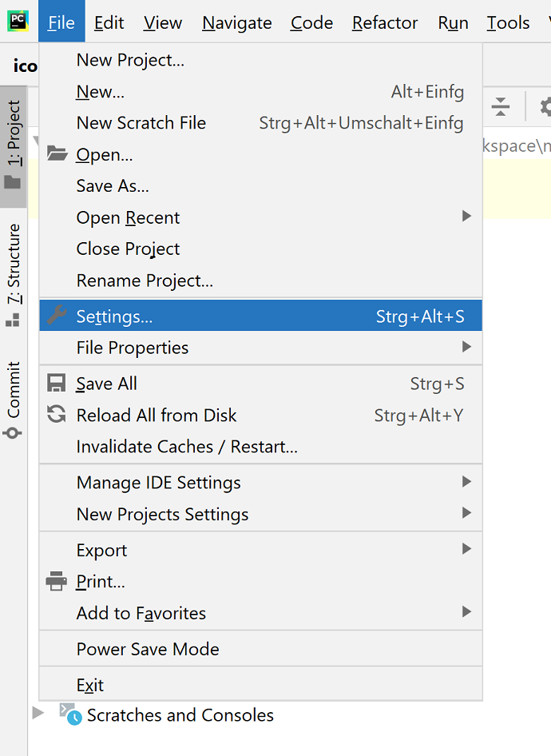
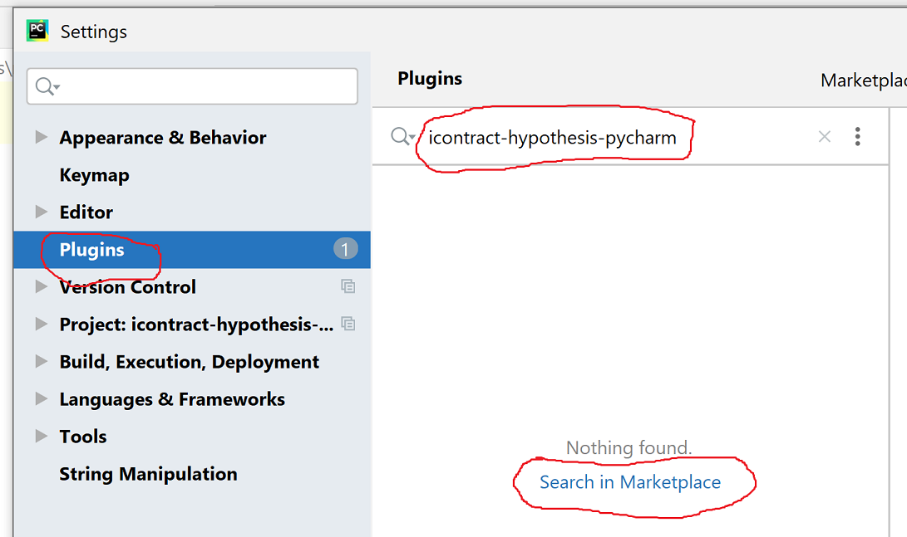
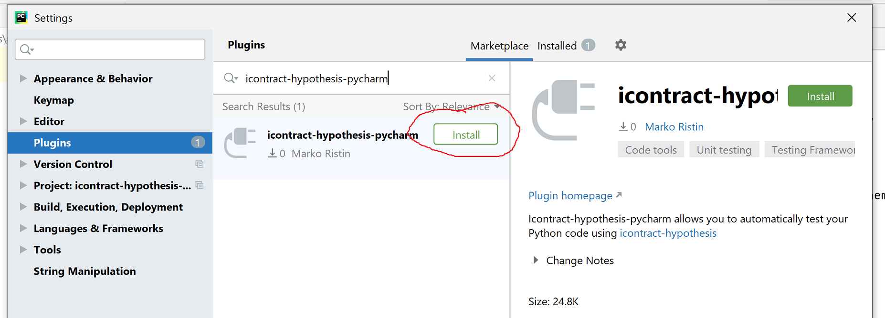
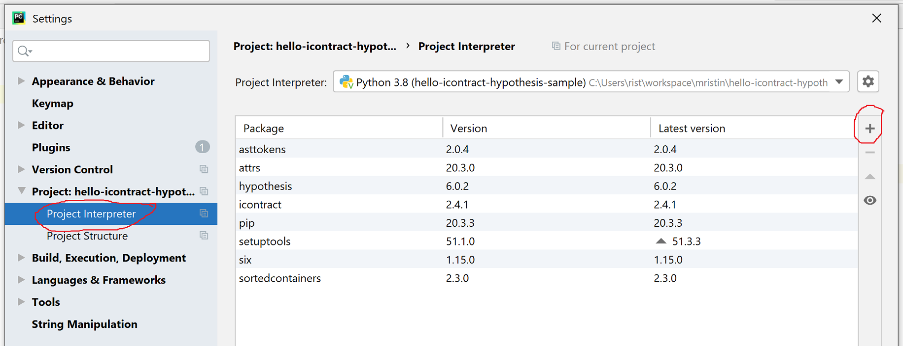
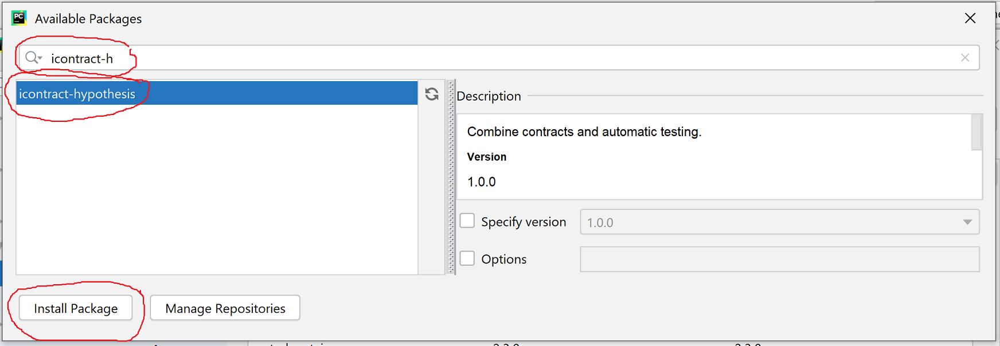
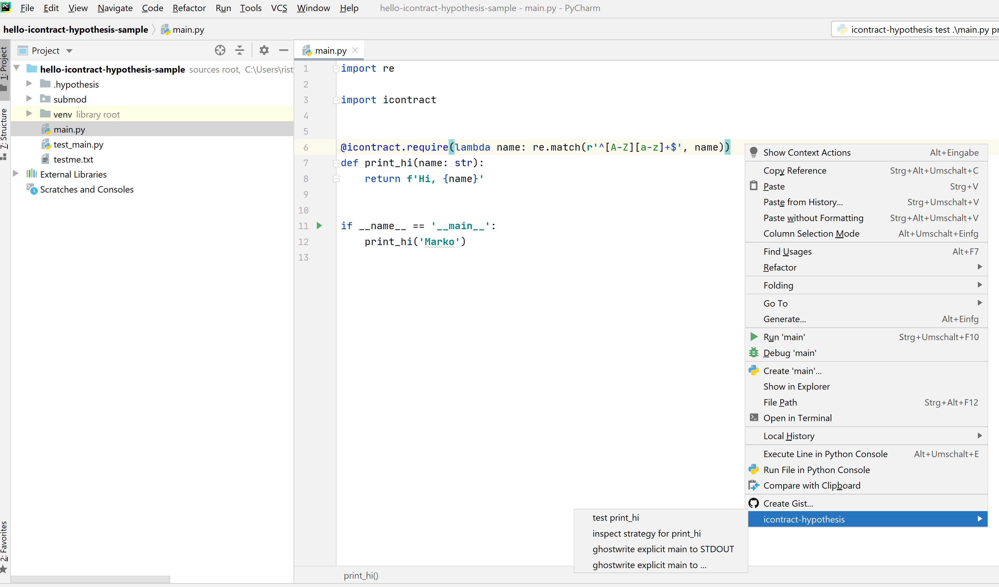
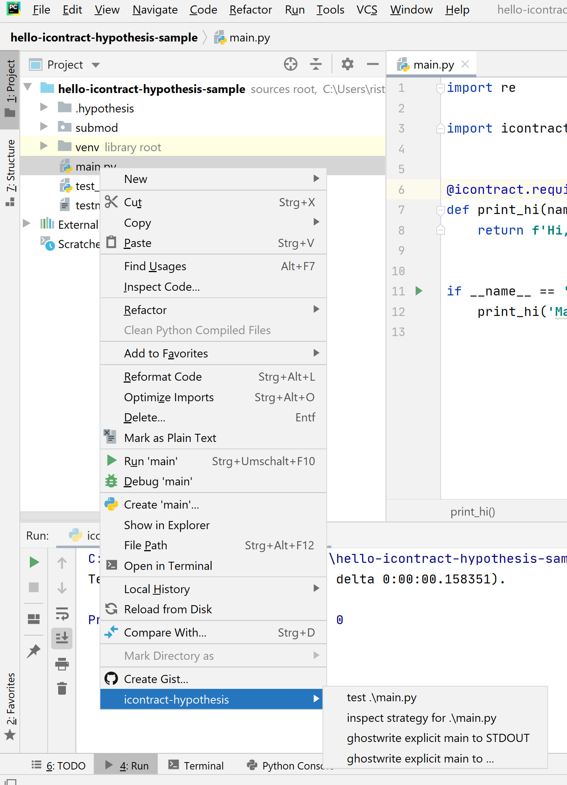

# icontract-hypothesis-pycharm

Icontract-hypothesis-pycharm is a plug-in for [PyCharm IDE](https://www.jetbrains.com/pycharm/) that
allows you to automatically test your Python code using 
[icontract-hypothesis](https://github.com/mristin/icontract-hypothesis).

## Installation

**Install icontract-hypothesis-pycharm**.
Use [Plug-in manager](https://www.jetbrains.com/help/pycharm/managing-plugins.html) in your PyCharm:
File ⟶ Settings ⟶ Plugins. 

Select `icontract-hypothesis-pycharm`.

**Install icontract-hypothesis**.
As icontract-hypothesis-pycharm is only a thin wrapper around 
[icontract-hypothesis](https://github.com/mristin/icontract-hypothesis), please install 
[icontract-hypothesis](https://github.com/mristin/icontract-hypothesis) manually in 
the virtual environment of your project.

For example, through: File ⟶ Settings ⟶ Project ⟶ Python Interpreter.

If you are writing a package using 
[`setup.py`](https://packaging.python.org/tutorials/packaging-projects/), you might want to include
[icontract-hypothesis](https://github.com/mristin/icontract-hypothesis) in 
[your test dependencies](https://stackoverflow.com/questions/15422527/best-practices-how-do-you-list-required-dependencies-in-your-setup-py).

## Usage

You can use icontract-hypothesis-pycharm from within an editor (with an open Python file) through
the editor pop-up menu:

Alternatively, you can select a file in the project view and access icontract-hypothesis-pycharm
through the project view pop-up menu:

### Actions

Icontract-hypothesis-pycharm creates the run configuration based on the selected action (described
below).

You can view and edit these run configurations manually or re-run them (usually by pressing 
Shift+F10).
Icontract-hypothesis-pycharm will *not* overwrite the run configurations so the manual changes will
persist.
For example, it is practical to modify the run configuration to disable certain health checks or
set Hypothesis parameters (such as 
[`max_examples`](https://github.com/mristin/icontract-hypothesis#testing-tool)). 

The icontract-hypothesis infers the Hypothesis strategies based on the contracts and types.
Depending on the user, the following actions are executed:

**Test {module or function}**.
The inferred Hypothesis strategies are executed (*i.e.*, the module or function are automatically
tested). 

**Inspect {module or function}**.
The inferred Hypothesis strategies are written to standard output so that the user can inspect them.

**Ghostwrite explicit {module} to STDOUT**.
The Hypothesis strategies inferred for a module are used to ghost-write and print a test file 
to the standard output.

The strategies are explicitly written (*i.e.*, the test file involves no references to 
`icontract-hypothesis`).

**Ghostwrite explicit {module} to ...**.
The Hypothesis strategies inferred for a module are used to ghost-write a test file.
The user is asked to select the destination.

The strategies are explicitly written (*i.e.*, the test file involves no references to 
`icontract-hypothesis`).

## Contributing

Feature requests or bug reports are always very, very welcome! 

Please see quickly if the issue does not already exist in the 
[issue section](https://github.com/mristin/icontract-hypothesis-pycharm/issues) and, if not,
create [a new issue](https://github.com/mristin/icontract-hypothesis-pycharm/issues/new).
 
You can also contribute in code.
Please use [GitHub's fork workflow](https://gist.github.com/Chaser324/ce0505fbed06b947d962).
The commit messages follow [Chris Beams' guidelines](https://chris.beams.io/posts/git-commit/).
Please discuss briefly the feature you'd like to implement beforehand so that we can 
explore together the use case and how it fits with the overall vision.

## Versioning

We follow a bit unusual semantic versioning schema:

* X is the oldest supported version of 
  [icontract-hypothesis](https://github.com/mristin/icontract-hypothesis),
* Y is the minor version (new or modified features), and
* Z is the patch version (only bug fixes).
