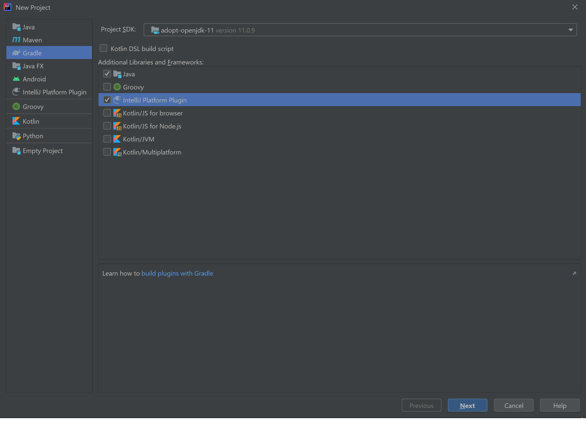
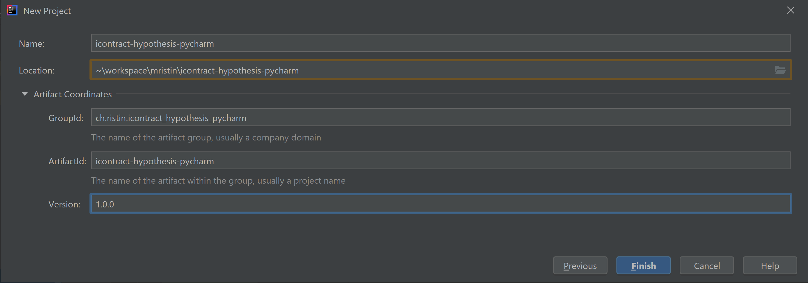

# Tips and Tricks when Developing a PyCharm Plug-in

Written by: Marko Ristin (marko@ristin.ch, 2021-01-20)

I found it hard to develop a PyCharm plug-in.
There were very few tutorials available, the information is scattered and the documentation usually
refers to IntelliJ SDK, but I couldn't find the up-to-date PyCharm API.
This left me with [JetBrains youtrack](https://youtrack.jetbrains.com) being my main source of
information.

Here is the list of tutorials that I found so far:
* [Live Development of a PyCharm Plugin (video)](https://www.youtube.com/watch?v=cR-28eaXGQI)
* http://kflu.github.io/2019/08/24/2019-08-24-writing-pycharm-plugin/
* https://github.com/JetBrains/intellij-sdk-code-samples/tree/main/product_specific/pycharm_basics

Here is the documentation of the IntelliJ Platform SDK:
https://plugins.jetbrains.com/docs/intellij/welcome.html

The group IDs and action IDs are pre-defined in:
https://github.com/JetBrains/intellij-community/blob/master/platform/platform-resources/src/idea/LangActions.xml

Here is how you can get an offset in the file:
https://intellij-support.jetbrains.com/hc/en-us/community/posts/206150409-How-do-I-get-to-PSI-from-a-document-or-editor-

A couple of PyCharm plug-ins I used as a reference:
* [pysynthetic-intellij](https://github.com/jhominal/pysynthetic-intellij)
* [pydantic-pycharm-plugin](https://github.com/koxudaxi/pydantic-pycharm-plugin)

## Creating a New Project

I used IntelliJ IDEA Community 2020.3.

Here are the steps:

**Download and install a java development kit.**

I installed [adopt-openjdk-11](https://adoptopenjdk.net/). 
  
It has to be the version 11, otherwise the JARs are incompatible with PyCharm 2020.

**Create a new project in IntelliJ.**

**Select Gradle project and tick "IntelliJ Platform Plugin"**.



**Specify the project coordinates.**



**Re-write `build.gradle` in the root directory.**

Remove the section `patchPluginXml` as we will directly edit the `plugin.xml`.  

Fix `intellij` section. Don't forget to include `plugins "python-ce"`!

**Re-write `src/main/resources/META-INF/plugin.xml`.**

Change the plug-in and vendor information.

Include `<depends>com.intellij.modules.python</depends>`.
Don't worry if it is marked red -- the PyCharm CE will be downloaded only in the next
step.

Remove `<extension>`'s for now. (Add extensions later if the plug-in really needs them.)

**Try to compile the project without any actions specified so far.**

The PyCharm-CE should be automatically downloaded together with the sources so that
you can easily debug.
The download might take a couple of minutes.

In contrast to [this tutorial](http://kflu.github.io/2019/08/24/2019-08-24-writing-pycharm-plugin/) 
and instructions from [pysynthetic-intellij](https://github.com/jhominal/pysynthetic-intellij), 
I didn't have to manually download PyCharm-CE and Gradle took care of it for me.

Restart IntelliJ now just for good luck.

**Define the `<action>`s in `plugin.xml`.**

Consult the IntelliJ Platform SDK on 
[how to gropu actions](https://plugins.jetbrains.com/docs/intellij/grouping-action.html).
See in particular what attributes `compact` and `popup` mean. (These were not obvious to me.)

As far as I can tell, if you want to hide the whole group when the user selects, say, a non-Python
file, you need to implement your own action group by extending the 
`com.intellij.openapi.actionSystem.DefaultActionGroup` and deciding when to show it in the 
overridden `update` method.

**Check that the Python dependencies are installed.**

Consult https://plugins.jetbrains.com/docs/intellij/sdk.html to see how to obtain the project's 
SDK.
(This was very tricky to search for on the web.)

Get the project's SDK with:

```java
final Sdk sdk = ProjectRootManager.getInstance(project).getProjectSdk();
```

Get the list of installed packages with:

```java
final var packages = PyPackageManager.getInstance(sdk).getPackages();
```

**Deploy the plugin.**

The documentation from https://plugins.jetbrains.com/docs/intellij/deploying-plugin.html is
confusing as it is not refering to a Gradle project though Gradle projects are *recommended* for
plugin development ("Gradle plugin is the recommended solution for building IntelliJ plugins", 
see https://plugins.jetbrains.com/docs/intellij/gradle-build-system.html).

[This IntelliJ support ticket](https://intellij-support.jetbrains.com/hc/en-us/community/posts/360000592024-Unable-to-prepare-IntelliJ-plugin-for-deployment)
explains the issue.

This is the section of the official documentation that explains how to build and publish the plugin:
https://plugins.jetbrains.com/docs/intellij/deployment.html.

You need to manually create a Gradle task as a run configuration:
* Click on "Edit configurations",
* Click on "+" (to add a new run configuration),
* Select "Gradle",
* Make the plug-in project your Gradle project,
* Write manually `buildPlugin` in the field "Tasks", and
* Run it.

The distribution should be available in `build/distributions/{your plugin}.zip`.

**Upload the plugin.**
Visit https://plugins.jetbrains.com/plugin/add.
